## MCP 协议

MCP 协议文档地址：[https://modelcontextprotocol.io/introduction](https://modelcontextprotocol.io/introduction)

中文版文档地址：[https://mcp-docs.cn/introduction](https://mcp-docs.cn/introduction)


- **MCP Hosts**: 如 Claude Desktop、IDE 或 AI 工具，希望通过 MCP 访问数据的程序
- **MCP Clients**: 维护与服务器一对一连接的协议客户端
- **MCP Servers**: 轻量级程序，通过标准的 Model Context Protocol 提供特定能力
- **本地数据源**: MCP 服务器可安全访问的计算机文件、数据库和服务
- **远程服务**: MCP 服务器可连接的互联网上的外部系统（如通过 APIs）

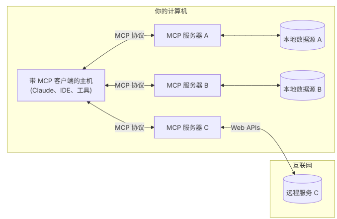

## 核心概念


### Transport

MCP 官方协议主要包含两个标准传输实现：

* 标准输入输出 (stdio)：主要对象是本地集成和命令行工具，使用 stdio 传输通过标准输入和输出流进行通信；
* 服务器发送事件 (SSE)：SSE 传输通过 HTTP POST 请求实现服务器到客户端的流式通信；


* StdioClientTransport
* SseClientTransport
* StreamClientTransport

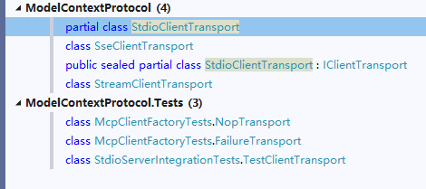


以下是 MCP（Message Channel Protocol）协议中 `stdio`、`sse`（Server-Sent Events）、`streamable` 三者的优缺点和差异的简要说明：

`stdio`

优点：

1. **平台兼容性高**：`stdio`（标准输入输出）是操作系统底层的功能，几乎所有操作系统和编程语言都支持。
2. **简单直接**：用于进程间通信，通常是脚本和命令行工具的通信方式，易于实现。

缺点：

1. **缺乏高级功能**：`stdio`只能处理简单的文本和二进制数据流，没有内建的消息结构或格式。
2. **不适合在网络环境中的实时交互**：`stdio`对于网络通信来说不够灵活和可靠，通常用于本地通信。

`sse`（Server-Sent Events）

优点：

1. **实时更新**：允许服务器通过HTTP连接主动向客户端发送更新消息，适合实时推送的应用场景。
2. **简单实现**：基于HTTP协议，不需要复杂的传输层协议，客户端通过EventSource API可以很容易地接收。
3. **轻量级**：相比WebSocket，SSE更轻量级，适合简单的消息推送场景。

缺点：

1. **单向通信**：只能服务器向客户端发送消息，客户端如果需要发送消息，必须通过标准的HTTP请求回服务器。
2. **连接限制**：浏览器对同时建立的SSE连接数限制较严格，不适合大量连接的应用场景。

`streamable`

这里的`streamable`可能指的是一个可以进行流式传输的协议特性，但具体含义可能不同环境中有所不同。下面根据流式传输的一般特性总结优缺点：

优点：

1. **效率高**：可以处理大数据或连续的数据流，不需要等待整个数据集传输完毕。
2. **实时性好**：可以在数据生成时逐步传输，在数据消费时逐步处理，提高实时响应能力。
3. **灵活性高**：支持长时间的连接和传输，适合视频、音频、实时数据库同步等应用。

缺点：

1. **复杂性高**：实现和管理流式传输协议、处理数据流的逻辑复杂度较高，需要确保数据的顺序和完整性。
2. **资源消耗**：长时间的连接和持续的数据传输可能会消耗较多的服务器和网络资源，需要优化处理。

总结：差异

`stdio` vs `sse` vs `streamable`

- **用途**：`stdio`主要用于进程间简单文本通信；`sse`用于服务器向客户端实时推送消息；`streamable`用于连续的数据流传输。
- **实时性**：`stdio`不设计用于实时通信；`sse`适用于服务器主动推送实时消息；`streamable`支持实时传输和处理。
- **复杂性**：`stdio`实现简单但功能简单；`sse`实现较为简单且专注实时推送；`streamable`实现复杂但功能强大适用范围广。
- **通信方向**：`stdio`双向但简单；`sse`单向服务器到客户端；`streamable`双向与长时间流传输。

通过这些比较，可以根据具体应用场景选择最适合的协议特性。


#### stdio

通过本地进程间通信实现，客户端以子进程形式启动服务器，双方通过**stdin/stdout**交换[JSON-RPC](https://zhida.zhihu.com/search?content_id=256527879&content_type=Article&match_order=1&q=JSON-RPC&zhida_source=entity)消息，每条消息以换行符分隔。

示例项目参考 TransportStdioServer、TransportStdioClient。

当使用 stdio 时，McpServer 只需要实现静态方法并配置特性注解即可，然后需要将该程序编译为 `.exe`。

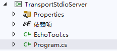

```csharp
[McpServerToolType]
public class EchoTool
{
    [McpServerTool, Description("Echoes the message back to the client.")]
    public static string Echo(string message) => $"hello {message}";
}
```

```csharp
using Microsoft.Extensions.DependencyInjection;
using Microsoft.Extensions.Hosting;
using Microsoft.Extensions.Logging;
using TransportStdioServer;

var builder = Host.CreateApplicationBuilder(args);

builder.Services.AddMcpServer()
    .WithStdioServerTransport()
    .WithTools<EchoTool>();

builder.Logging.AddConsole(options =>
{
    options.LogToStandardErrorThreshold = LogLevel.Trace;
});


await builder.Build().RunAsync();
```


然后编译项目，在 Windows 下会有 `.exe` 文件，复制文件的绝对路径。

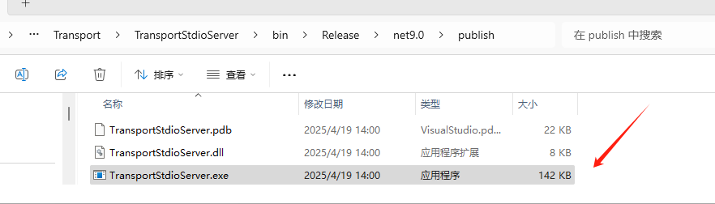


C# 编写客户端时，需要通过命令行参数导入 `.exe` 。

```csharp
using Microsoft.Extensions.Configuration;
using Microsoft.Extensions.Hosting;
using ModelContextProtocol.Client;
using ModelContextProtocol.Protocol.Transport;

var builder = Host.CreateApplicationBuilder(args);

builder.Configuration
    .AddEnvironmentVariables()
    .AddUserSecrets<Program>();

var clientTransport = new StdioClientTransport(new()
{
    Name = "Demo Server",
    // 要使用绝对路径，这里笔者省略了
    Command = "E:/../../TransportStdioServer.exe"
});

await using var mcpClient = await McpClientFactory.CreateAsync(clientTransport);

var tools = await mcpClient.ListToolsAsync();
foreach (var tool in tools)
{
    Console.WriteLine($"Connected to server with tools: {tool.Name}");
}
```


启动 TransportStdioClient，控制台会打印 TransportStdioServer 中的所有 Mcp tool。

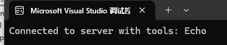

StdioClientTransport 基于命令行参数启动 TransportStdioServer。

```
cmd.exe/c E:/../TransportStdioServer.exe
```

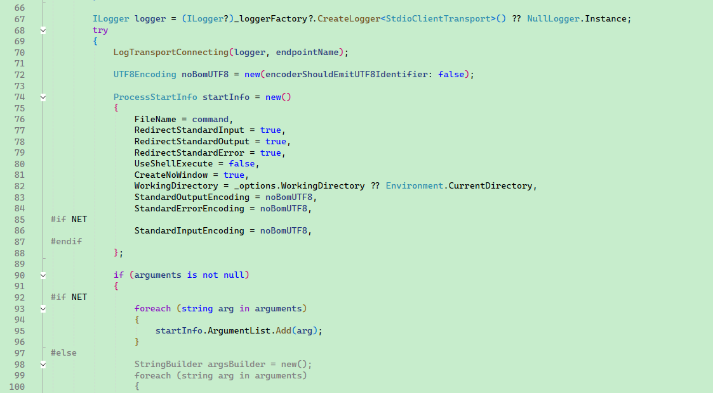


#### sse

参考示例项目：TransportSseServer、TransportSseClient。

通过HTTP长连接实现远程通信，服务器需提供两个端点：

- **/sse**（GET请求）：建立长连接，接收服务器推送的事件流。
- **/messages**（POST请求）：客户端发送请求至该端点。


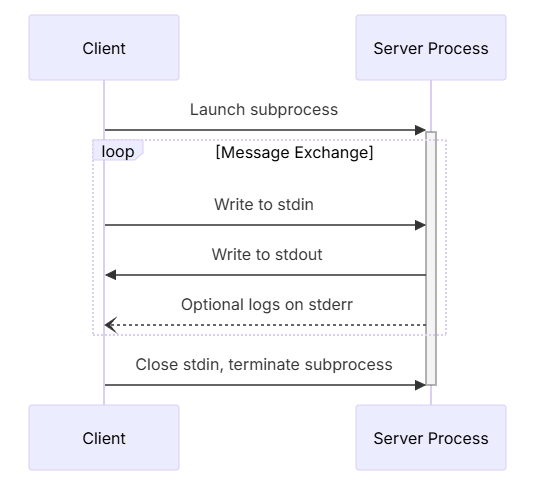


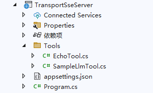

在 TransportSseServer 实现简单的 EchoTool。

```csharp
[McpServerToolType]
public sealed class EchoTool
{
    [McpServerTool, Description("Echoes the input back to the client.")]
    public static string Echo(string message)
    {
        return "hello " + message;
    }
}
```

配置 Mcp 服务：

```csharp
using TransportSseServer.Tools;

var builder = WebApplication.CreateBuilder(args);
builder.Services.AddMcpServer()
    .WithHttpTransport()
    .WithTools<EchoTool>()
    .WithTools<SampleLlmTool>();

var app = builder.Build();

app.MapMcp();

app.Run("http://0.0.0.0:5000");

```


TransportSseClient 实现客户端连接 Web Mcp Server。

```csharp
using Microsoft.Extensions.Logging;
using Microsoft.Extensions.Logging.Abstractions;
using ModelContextProtocol.Client;
using ModelContextProtocol.Protocol.Transport;

var defaultOptions = new McpClientOptions
{
    ClientInfo = new() { Name = "IntegrationTestClient", Version = "1.0.0" }
};

var defaultConfig = new SseClientTransportOptions
{
    Endpoint = new Uri($"http://localhost:5000/sse"),
    Name = "Everything",
};

// Create client and run tests
await using var client = await McpClientFactory.CreateAsync(
    new SseClientTransport(defaultConfig),
    defaultOptions,
    loggerFactory: NullLoggerFactory.Instance);

var tools = await client.ListToolsAsync();

foreach (var tool in tools)
{
    Console.WriteLine($"Connected to server with tools: {tool.Name}");
}
```


#### streamable 

- Streamable HTTP是SSE的升级方案，完全基于标准HTTP协议，移除了专用SSE端点，所有消息通过**/message**端点传输。
- **动态升级**：服务器可根据需要将普通HTTP请求升级为SSE流，支持流式响应。

由于未找到案例，本节不讲解。


#### 手动调用 Mcp tool

以 TransportSseClient 为例。

```csharp
var echoTool = tools.First(x => x.Name == "Echo");
var result = await client.CallToolAsync("Echo", new Dictionary<string, object?>
{
    { "message","痴者工良"}
});

foreach (var item in result.Content)
{
    Console.WriteLine($"type: {item.Type},text: {item.Text}");
}
```


后续将会讲解如何通过 SK 将 mcp tool 提供给 AI 模型。


## Mcp tool 说明

C# mcp server 各方面的设计


```csharp
[McpServerToolType]
public sealed class EchoTool
{
    [McpServerTool, Description("Echoes the input back to the client.")]
    public static string Echo(string message)
    {
        return "hello " + message;
    }
}
```


Mcp server 可以通过以下两种方式暴露 tool。

```csharp
builder.Services
    .AddMcpServer()
    .WithHttpTransport()
    .WithTools<EchoTool>()
    .WithTools<SampleLlmTool>();

builder.Services
    .AddMcpServer()
    .WithHttpTransport()
    .WithStdioServerTransport()
    .WithToolsFromAssembly();
```


使用 `McpClientTool.ProtocolTool.InputSchema` 获取 tool 的输入参数格式：

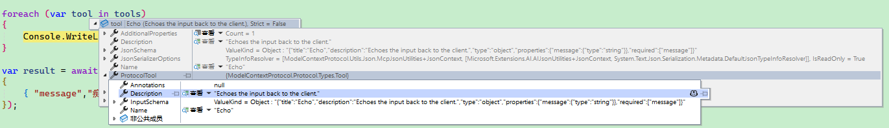

```json
Annotations: null
Description: "Echoes the input back to the client."
Name: "Echo"
InputSchema: "{"title":"Echo","description":"Echoes the input back to the client.","type":"object","properties":{"message":{"type":"string"}},"required":["message"]}"
```


`[McpServerToolType]` 用于将包含应该作为ModelContextProtocol.Server.McpServerTools公开的方法的类型属性化。

`[McpServerTool]`用于指示应该将方法视为 ModelContextProtocol.Server.McpServerTool。

`[Description]` 则用于添加注释。


### 依赖注入

参考示例项目 InjectServer、InjectClient。

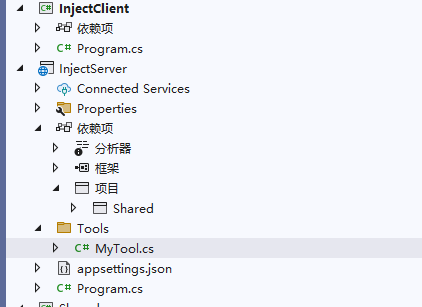

```csharp
public class MyService
{
    public string Echo(string message)
    {
        return "hello " + message;
    }
}
```

```
builder.Services.AddScoped<MyService>();
```

```csharp
[McpServerToolType]
public sealed class MyTool
{
    [McpServerTool, Description("Echoes the input back to the client.")]
    public static string Echo(MyService myService, string message)
    {
        return myService.Echo(message);
    }
}
```


### Tool 注入 IMcpServer 的作用

每次对话时，Client 调用 Tool 时是会将当前对话上下文推送到 Tool method 的，因此可以在该 tool 内读取对话历史、修改对话历史，结合后面章节提到的 Resources、Prompts、Sampling 等功能，可以实现对话补全、远程知识库等功能。


ps：演示读取聊天记录、添加对话历史


### 将 Mcp tool 提交到 AI 对话中

当你提出问题时：

1. client 将你的问题发送给 Claude
2. Claude 分析可用的 tools 并决定使用哪些 tool
3. client 通过 MCP server 执行选择的 tool
4. 结果被发回给 Claude
5. Claude 制定自然语言响应
6. 响应显示给你！


```csharp
// Get available functions.
IList<McpClientTool> tools = await client.ListToolsAsync();

// Call the chat client using the tools.
IChatClient chatClient = ...;
var response = await chatClient.GetResponseAsync(
    "your prompt here",
    new() { Tools = [.. tools] },
```


### 高德地图 mcp 实战


这里笔者使用 Amap Maps 实现旅游流程规划。

- 地理编码
- 逆地理编码
- IP 定位
- 天气查询
- 骑行路径规划
- 步行路径规划
- 驾车路径规划
- 公交路径规划
- 距离测量
- 关键词搜索
- 周边搜索
- 详情搜索

```
Connected to server with tools: maps_direction_bicycling
Connected to server with tools: maps_direction_driving
Connected to server with tools: maps_direction_transit_integrated
Connected to server with tools: maps_direction_walking
Connected to server with tools: maps_distance
Connected to server with tools: maps_geo
Connected to server with tools: maps_regeocode
Connected to server with tools: maps_ip_location
Connected to server with tools: maps_around_search
Connected to server with tools: maps_search_detail
Connected to server with tools: maps_text_search
Connected to server with tools: maps_weather
```


打开 [https://console.amap.com/dev/key/app](https://console.amap.com/dev/key/app) 创建一个新的应用，然后复制 key。

高德 mcp 服务器地址：

```csharp
https://mcp.amap.com/sse?key={在高德官网上申请的key}
```


在 `appsettings.json` 添加以下 json。

```csharp
  "McpServers": {
    "amap-amap-sse": {
      "url": "https://mcp.amap.com/sse?key={在高德官网上申请的key}"
    }
  },
  "AIModel": {
    "ModelId": "gpt-4o",
    "DeploymentName": "gpt-4o",
    "Endpoint": "https://openai.com/",
    "Key": "aaaaaaaa"
  }
```

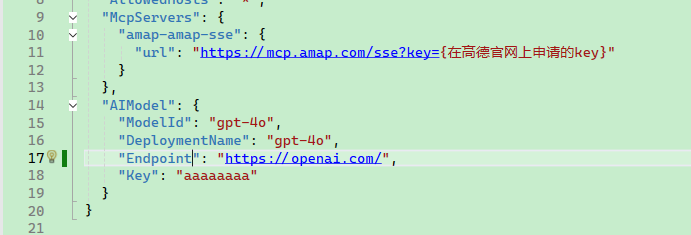


导入配置并创建日志：

```csharp
var configuration = new ConfigurationBuilder()
    .AddJsonFile("appsettings.json")
    .AddJsonFile("appsettings.Development.json")
    .Build();

using ILoggerFactory factory = LoggerFactory.Create(builder => builder.AddConsole());
```


#### 第一步：创建 mcp 客户端

```csharp
var defaultOptions = new McpClientOptions
{
    ClientInfo = new() { Name = "地图规划", Version = "1.0.0" }
};

var defaultConfig = new SseClientTransportOptions
{
    Endpoint = new Uri(configuration["McpServers:amap-amap-sse:url"]!),
    Name = "amap-amap-sse",
};

await using var client = await McpClientFactory.CreateAsync(
    new SseClientTransport(defaultConfig),
    defaultOptions,
    loggerFactory: factory);

var tools = await client.ListToolsAsync();

foreach (var tool in tools)
{
    Console.WriteLine($"Connected to server with tools: {tool.Name}");
}
```

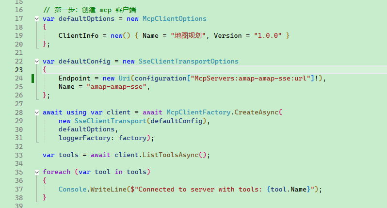

#### 第二步：连接 AI 模型和配置 mcp

```csharp
var aiModel = configuration.GetSection("AIModel");
var builder = Kernel.CreateBuilder()
    .AddAzureOpenAIChatCompletion(
    deploymentName: aiModel["ModelId"],
    endpoint: aiModel["Endpoint"],
    apiKey: aiModel["Key"]);

builder.Services.AddLogging(s =>
{
    s.AddConsole();
});

Kernel kernel = builder.Build();

// 这里将 mcp 转换为 functaion call
kernel.Plugins.AddFromFunctions("amap", tools.Select(aiFunction => aiFunction.AsKernelFunction()));

var chatCompletionService = kernel.GetRequiredService<IChatCompletionService>();

OpenAIPromptExecutionSettings openAIPromptExecutionSettings = new()
{
    Temperature = 0,
    FunctionChoiceBehavior = FunctionChoiceBehavior.Auto(options: new() { RetainArgumentTypes = true })
};
```

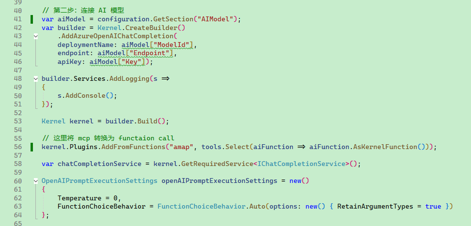


#### 第三步：对话交互

定义 AI 模型参数

```
var history = new ChatHistory();

string? userInput;
do
{
    Console.Write("用户提问 > ");
    userInput = Console.ReadLine();

    history.AddUserMessage(userInput!);

    var result = await chatCompletionService.GetChatMessageContentAsync(
        history,
        executionSettings: openAIPromptExecutionSettings,
        kernel: kernel);

    Console.WriteLine("AI 回答 > " + result);

    history.AddMessage(result.Role, result.Content ?? string.Empty);
} while (userInput is not null);
```

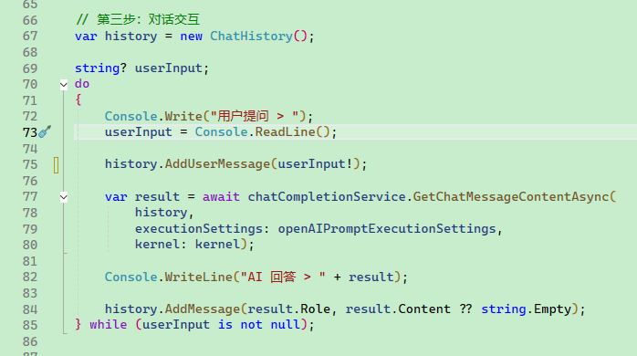


### 演示地图规划

**1. 智能旅游路线规划**

最多支持16个途经点的旅游路线规划，自动计算最优顺序，并提供可视化地图链接。

**使用示例**：

```
请帮我规划一条上海三日游路线，包括外滩、东方明珠、迪士尼、豫园、南京路，并提供可视化地图
```

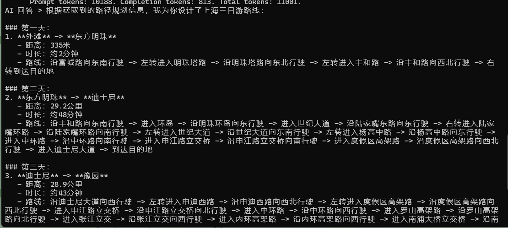


**2. 景点搜索与详情查询**

查询景点的详细信息，包括评分、开放时间、门票价格等。

使用示例：

```
请查询黄山风景区的开放时间、门票价格和旅游季节推荐
```

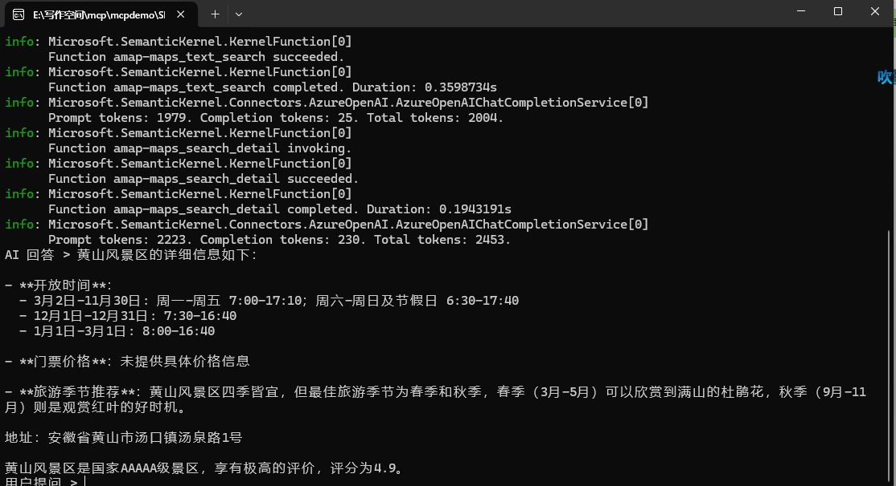


### AI 是怎么识别调用 MCP

在编写高德地图规划时，有一段代码是将 MCP 服务器的接口转换为 Function call 的，代码如下：

```csharp
kernel.Plugins
.AddFromFunctions("amap", tools.Select(aiFunction => aiFunction.AsKernelFunction()))
```


其实在这里就可以下结论，并不是 AI 模型直接调用 MCP Server 的，依然是  Function call 。

通过拦截 http 请求可以发现，当用户输入 `请帮我规划一条上海三日游路线，包括外滩、东方明珠、迪士尼、豫园、南京路，并提供可视化地图` 时，客户端首先将用户提问和 mcp 服务所提供的 function call 一起发送到 AI 模型服务器。

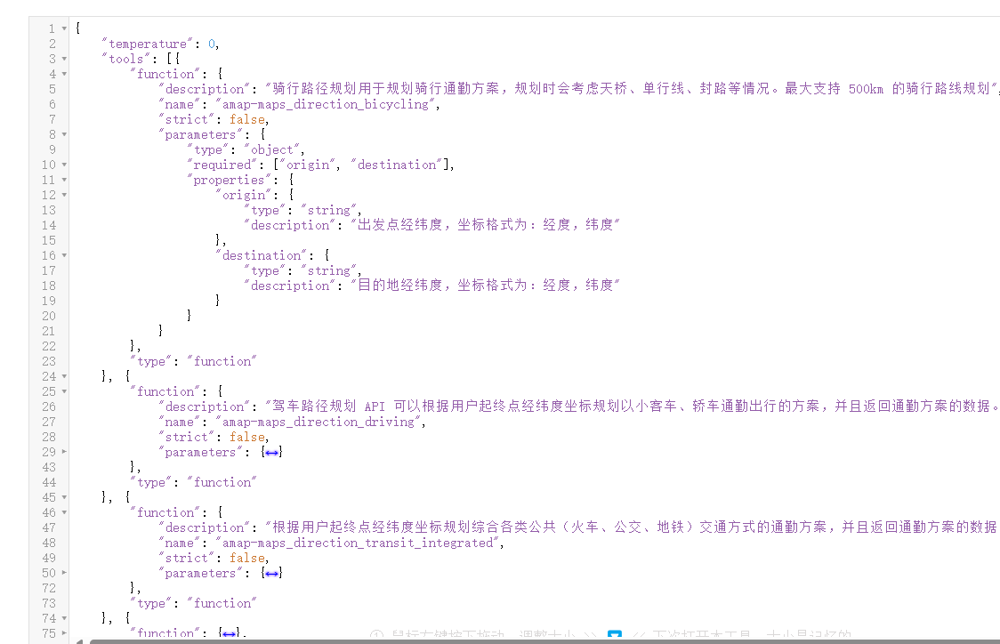


然后AI 回答要调用的 function call(mcp server) 步骤和参数，接着由客户端实现调用每个接口。

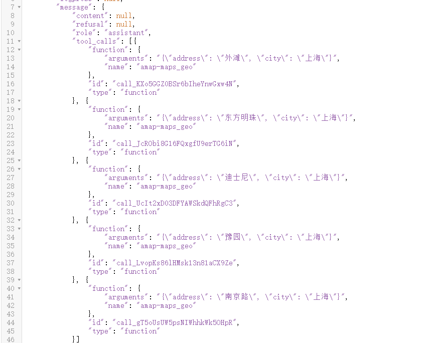


客户端将每个 function call 的执行结果和用户的提问等信息，一起再次提交给 AI 模型服务器。

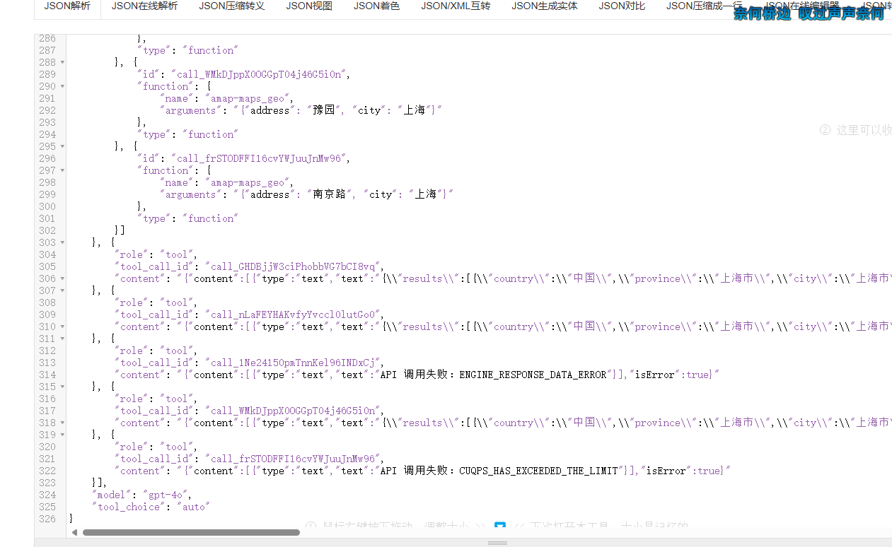


由于高德接口并发限制，有部分接口调用失败，那么客户端可能会来回请求多次，最后输出 AI 的回答。

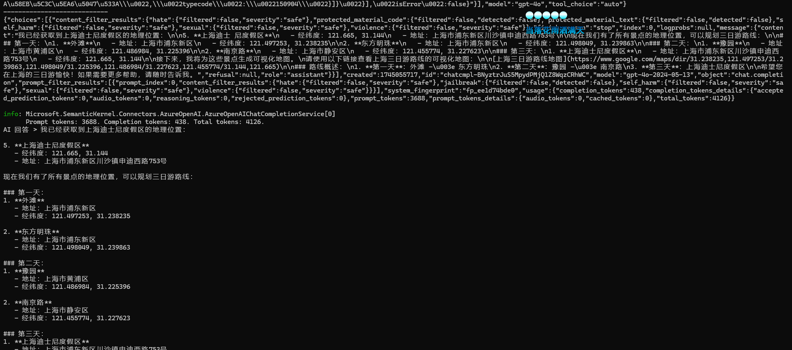


## 实现 Mcp Server

MCP 协议定义了以下核心模块：

- Core architecture
- Resources
- Prompts
- Tools
- Sampling
- Roots
- Transports


作为当前社区中最关注的 Tools，本文已经单独介绍，接下来将会以继续讲解其它功能模块。


### 实现 Resources

Resources 定义：Resources 是 Model Context Protocol (MCP) 中的一个核心原语，它允许服务器暴露可以被 clients 读取并用作 LLM 交互上下文的数据和内容。

Resources 代表 MCP server 想要提供给 clients 的任何类型的数据。这可以包括：

- 文件内容
- 数据库记录
- API 响应
- 实时系统数据
- 屏幕截图和图像
- 日志文件
- 等等

每个 resource 都由一个唯一的 URI 标识，并且可以包含文本或二进制数据。

Resources 使用以下格式的 URIs 进行标识：

```plaintext
[protocol]://[host]/[path]
```

例如：

- `file:///home/user/documents/report.pdf`
- `postgres://database/customers/schema`
- `screen://localhost/display1`

文本资源

文本资源包含 UTF-8 编码的文本数据。这些适用于：

- 源代码
- 配置文件
- 日志文件
- JSON/XML 数据
- 纯文本

二进制资源

二进制资源包含以 base64 编码的原始二进制数据。这些适用于：

- 图像
- PDFs
- 音频文件
- 视频文件
- 其他非文本格式


#### Resources Server、Client 实现

客户端使用 Resources 服务时，有以下 Api，那么在本节的学习中，将会围绕这这些接口讲解如何在服务段实现对应的功能。

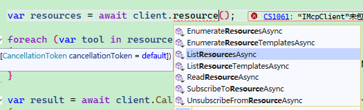

实现 Resources 时，主要有两种提供 Resources 的方式，一种是通过模板动态提供 Resource Uri 的格式，一种是直接提供具体的 Resource Uri。

Resource Uri 格式示例：

```
"test://static/resource/{README.txt}"
```


MCP Server 提供的 Resource Uri 格式是可以随意自定义的，这些 Uri 并不是直接给 Client 读取的，Client 在需要读取 Resource 是，把 Uri 发送给 MCP Server，MCP Server 自行解析 Uri 并定位对应的资源，然后把资源内容返回给 Client。


通过模板提供某类资源，这类资源的的地址是动态的，要根据 id 实时获取。

```csharp
builder.Services.AddMcpServer()
        .WithListResourceTemplatesHandler(async (ctx, ct) =>
        {
            return new ListResourceTemplatesResult
            {
                ResourceTemplates =
                [
                    new ResourceTemplate { Name = "Static Resource", Description = "A static resource with a numeric ID", UriTemplate = "test://static/resource/{id}" }
                ]
            };
        });
```


对于地址固定的 Resource，可以通过这种方式暴露出去。


```csharp
builder.Services.AddMcpServer()
		.WithListResourcesHandler(async (ctx, ct) =>
        {
            await Task.CompletedTask;
            var readmeResource = new Resource
            {
                Uri = "test://static/resource/README.txt",
                Name = "Resource README.txt",
                MimeType = "application/octet-stream",
                Description = Convert.ToBase64String(Encoding.UTF8.GetBytes("这是一个必读文件"))
            };

            return new ListResourcesResult
            {
                Resources = new List<Resource>
                {
                    readmeResource
                }
            };
        })
```


客户端读取资源模板和静态资源列表：

```csharp
var defaultOptions = new McpClientOptions
{
    ClientInfo = new() { Name = "ResourceClient", Version = "1.0.0" }
};

var defaultConfig = new SseClientTransportOptions
{
    Endpoint = new Uri($"http://localhost:5000/sse"),
    Name = "Everything",
};

// Create client and run tests
await using var client = await McpClientFactory.CreateAsync(
    new SseClientTransport(defaultConfig),
    defaultOptions,
    loggerFactory: NullLoggerFactory.Instance);

var resourceTemplates = await client.ListResourceTemplatesAsync();
var resources = await client.ListResourcesAsync();

foreach (var template in resourceTemplates)
{
    Console.WriteLine($"Connected to server with resource templates: {template.Name}");
}

foreach (var resource in resources)
{
    Console.WriteLine($"Connected to server with resources: {resource.Name}");
}
```


那么，客户端如果从 MCP 服务器读取资源只需要将 Resource Uri 传递即可。

```csharp
var readmeResource = await client.ReadResourceAsync(resources.First().Uri);
```


这里只介绍了 MCP Server 提供 Resource Uri，那么当 Client 要获取某个 Resource Uri 的内容时，MCP Server 要怎么处理呢？

ModelContextProtocol CSharp 目前提供了两种实现：

* TextResourceContents

* BlobResourceContents


比如说，当 Client 访问 `test://static/resource/README.txt` 时，可以将 README.txt 文件直接以文本的形式返回：

```csharp
    .WithReadResourceHandler(async (ctx, ct) =>
    {
        var uri = ctx.Params?.Uri;

        if (uri is null || !uri.StartsWith("test://static/resource/"))
        {
            throw new NotSupportedException($"Unknown resource: {uri}");
        }

        if(uri == "test://static/resource/README.txt")
        {
            var readmeResource = new Resource
            {
                Uri = "test://static/resource/README.txt",
                Name = "Resource README.txt",
                MimeType = "application/octet-stream",
                Description = "这是一个必读文件"
            };
            return new ReadResourceResult
            {
                Contents = [new TextResourceContents
                {
                    Text = File.ReadAllText("README.txt"),
                    MimeType = readmeResource.MimeType,
                    Uri = readmeResource.Uri,
                }]
            };
        }
    })
```

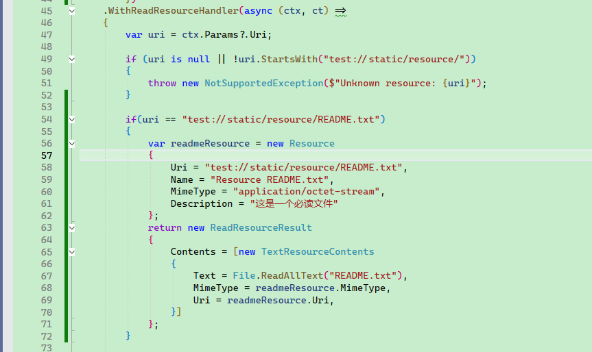


如果访问其它 Resource，都以二进制的形式返回：

```csharp
    .WithReadResourceHandler(async (ctx, ct) =>
    {
        var uri = ctx.Params?.Uri;

        if (uri is null || !uri.StartsWith("test://static/resource/"))
        {
            throw new NotSupportedException($"Unknown resource: {uri}");
        }

        int index = int.Parse(uri["test://static/resource/".Length..]) - 1;

        if (index < 0 || index >= ResourceGenerator.Resources.Count)
        {
            throw new NotSupportedException($"Unknown resource: {uri}");
        }

        var resource = ResourceGenerator.Resources[index];
        return new ReadResourceResult
        {
            Contents = [new TextResourceContents
                {
                    Text = resource.Description!,
                    MimeType = resource.MimeType,
                    Uri = resource.Uri,
                }]
        };
    })
```


客户端读取 `"test://static/resource/README.txt"` 示例：

```csharp
var readmeResource = await client.ReadResourceAsync(resources.First().Uri);
var textContent = readmeResource.Contents.First() as TextResourceContents;
Console.WriteLine(Encoding.UTF8.GetString(Convert.FromBase64String(textContent.Text)));
```


#### Resource 订阅

Clients 可以订阅特定 resources 的更新：

1. Client 使用 resource URI 发送 `resources/subscribe`
2. 当 resource 更改时，服务器发送 `notifications/resources/updated`
3. Client 可以使用 `resources/read` 获取最新内容
4. Client 可以使用 `resources/unsubscribe` 取消订阅


一般来说，MCP Server 要实现工厂模式，以便动态记录有哪些 Resource Uri 是被订阅的，那么当这些 Uri 的资源发生变化时，才需要推送，否则即使发送变化，也没有推送更新的必要。

但是目前来说，只有 `WithStdioServerTransport()` 才能起效，笔者在 `WithHttpTransport()` 实验失败。

```csharp
    .WithSubscribeToResourcesHandler(async (ctx, ct) =>
    {
        var uri = ctx.Params?.Uri;

        if (uri is not null)
        {
            subscriptions.Add(uri);
        }

        return new EmptyResult();
    })
    .WithUnsubscribeFromResourcesHandler(async (ctx, ct) =>
    {
        var uri = ctx.Params?.Uri;
        if (uri is not null)
        {
            subscriptions.Remove(uri);
        }
        return new EmptyResult();
    });
```


例如，我们可以一个接口，手动触发更新订阅了 `"test://static/resource/README.txt` 的 Client。

```csharp
        await _mcpServer.SendNotificationAsync("notifications/resource/updated",
            new
            {
                Uri = "test://static/resource/README.txt",
            });

        return "已通知";
```


客户端只需要很简单的代码即可订阅。

```csharp
client.RegisterNotificationHandler("notifications/resource/updated", async (message, ctx) =>
{
    await Task.CompletedTask;
    
    // 回调
});
await client.SubscribeToResourceAsync("test://static/resource/README.txt");
```


####  最佳实践

在实现 resource 支持时：

1. 使用清晰、描述性的 resource 名称和 URIs
2. 包含有用的描述以指导 LLM 理解
3. 在已知时设置适当的 MIME 类型
4. 为动态内容实现 resource 模板
5. 对频繁更改的 resources 使用订阅
6. 使用清晰的错误消息优雅地处理错误
7. 考虑对大型 resource 列表进行分页
8. 在适当的时候缓存 resource 内容
9. 在处理之前验证 URIs
10. 记录你的自定义 URI 方案

#### 安全考虑

在暴露 resources 时：

- 验证所有 resource URIs
- 实现适当的访问控制
- 清理文件路径以防止目录遍历
- 谨慎处理二进制数据
- 考虑对 resource 读取进行速率限制
- 审核 resource 访问
- 加密传输中的敏感数据
- 验证 MIME 类型
- 为长时间运行的读取操作实现超时
- 适当处理 resource 清理


### 实现 Prompts

创建可复用的提示模板和工作流

Prompts 允许 servers 定义可复用的提示模板和工作流，clients 可以轻松地将它们呈现给用户和 LLMs。它们提供了一种强大的方式来标准化和共享常见的 LLM 交互。


MCP 中的 Prompts 是预定义的模板，可以：

- 接受动态参数
- 包含来自 resources 的上下文
- 链接多个交互
- 引导特定的工作流程
- 呈现为 UI 元素（如斜杠命令）


MCP Server 示例：

```csharp
[McpServerPromptType]
public static class MyPrompts
{
    [McpServerPrompt, Description("Creates a prompt to summarize the provided message.")]
    public static ChatMessage Summarize([Description("The content to summarize")] string content) =>
        new(ChatRole.User, $"Please summarize this content into a single sentence: {content}");
}
```


根据官方框架仓库的示例，Prompts 主要有两种使用方式。

第一种直接返回字符串。

```csharp
[McpServerPromptType]
public class SimplePromptType
{
    [McpServerPrompt(Name = "simple_prompt"), Description("A prompt without arguments")]
    public static string SimplePrompt() => "This is a simple prompt without arguments";
}

```


第二种则是编排对话上下文再返回。

```csharp
[McpServerPromptType]
public class ComplexPromptType
{
    [McpServerPrompt(Name = "complex_prompt"), Description("A prompt with arguments")]
    public static IEnumerable<ChatMessage> ComplexPrompt(
        [Description("Temperature setting")] int temperature,
        [Description("Output style")] string? style = null)
    {
        return [
            new ChatMessage(ChatRole.User,$"This is a complex prompt with arguments: temperature={temperature}, style={style}"),
            new ChatMessage(ChatRole.Assistant, "I understand. You've provided a complex prompt with temperature and style arguments. How would you like me to proceed?"),
            new ChatMessage(ChatRole.User, [new DataContent(Convert.ToBase64String(File.ReadAllBytes("img.png")))])
        ];
    }
}

```


Client 可以获取 MCP Server 提供的提示词列表。

```csharp
var prompts = await client.ListPromptsAsync();
foreach (var item in prompts)
{
    Console.WriteLine($"prompt name :{item.Name}");
}

```


客户端可以通过使用需要的提示词，将其自动加载到当前 AI 对话上下文中。

```csharp

var result = await prompts.First(x => x.Name == "test").GetAsync(new Dictionary<string, object?>() { ["message"] = "hello" });
IList<ChatMessage> chatMessages = result.ToChatMessages();

```


最佳实践

在实现 prompts 时：

1. 使用清晰、描述性的 prompt 名称
2. 为 prompts 和参数提供详细的描述
3. 验证所有必需的参数
4. 优雅地处理缺失的参数
5. 考虑 prompt 模板的版本控制
6. 在适当的时候缓存动态内容
7. 实现错误处理
8. 记录预期的参数格式
9. 考虑 prompt 的可组合性
10. 使用各种输入测试 prompts

UI 集成

Prompts 可以在 client UI 中呈现为：

- 斜杠命令
- 快速操作
- 上下文菜单项
- 命令面板条目
- 引导式工作流程
- 交互式表单


### 实现 Sampling

让你的 servers 从 LLMs 请求补全

Sampling 是一个强大的 MCP 功能，它允许 servers 通过 client 请求 LLM 补全，从而实现复杂的 agentic 行为，同时保持安全性和隐私性。


Sampling 流程遵循以下步骤：

1. Server 向 client 发送 `sampling/createMessage` 请求
2. Client 审查请求并可以修改它
3. Client 从 LLM 中 sampling
4. Client 审查补全结果
5. Client 将结果返回给 server

这种人机交互设计确保用户可以控制 LLM 看到和生成的内容。

按笔者理解来说， Sampling 适合 AI Agent 应用，服务器下方命令给 Client 后，Client 自身通过 LLM 等完成任务，并将结果返回给 Server。

但是目前来说， ModelContextProtocol Csharp 应该缺乏这种功能，因为 IMcpServer 只能出现在 Client 请求 Server 时的上下文中，而 Server 是不能随意找到 Client 的，不能通过注入 IMcpServer 去给 Client 下发任务。

对于 stdio 方式的 MCP Server 来说，可以通过以下方式实现 Sampling。

```
await ctx.Server.RequestSamplingAsync([
	new ChatMessage(ChatRole.System, "You are a helpful test server"),
	new ChatMessage(ChatRole.User, $"Resource {uri}, context: A new subscription was started"),
],
```


对于 http 方式实现的 MCP Server ，由于不能实现 Server 调用 Client ，因此这里不再赘述。


### 实现 Roots


## 将 Swagger 转换为 Mcp

```csharp
using ModelContextProtocol.Protocol.Transport;
using ModelContextProtocol.Protocol.Types;
using ModelContextProtocol.Server;
using System.Text.Json;

McpServerOptions options = new()
{
    ServerInfo = new Implementation() { Name = "MyServer", Version = "1.0.0" },
    Capabilities = new ServerCapabilities()
    {
        Tools = new ToolsCapability()
        {
            ListToolsHandler = (request, cancellationToken) =>
                Task.FromResult(new ListToolsResult()
                {
                    Tools =
                    [
                        new Tool()
                        {
                            Name = "echo",
                            Description = "Echoes the input back to the client.",
                            InputSchema = JsonSerializer.Deserialize<JsonElement>("""
                                {
                                    "type": "object",
                                    "properties": {
                                      "message": {
                                        "type": "string",
                                        "description": "The input to echo back"
                                      }
                                    },
                                    "required": ["message"]
                                }
                                """),
                        }
                    ]
                }),

            CallToolHandler = (request, cancellationToken) =>
            {
                if (request.Params?.Name == "echo")
                {
                    if (request.Params.Arguments?.TryGetValue("message", out var message) is not true)
                    {
                        throw new McpException("Missing required argument 'message'");
                    }

                    return Task.FromResult(new CallToolResponse()
                    {
                        Content = [new Content() { Text = $"Echo: {message}", Type = "text" }]
                    });
                }

                throw new McpException($"Unknown tool: '{request.Params?.Name}'");
            },
        }
    },
};

await using IMcpServer server = McpServerFactory.Create(new StdioServerTransport("MyServer"), options);
await server.RunAsync();
```
